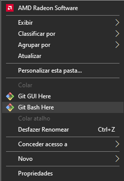
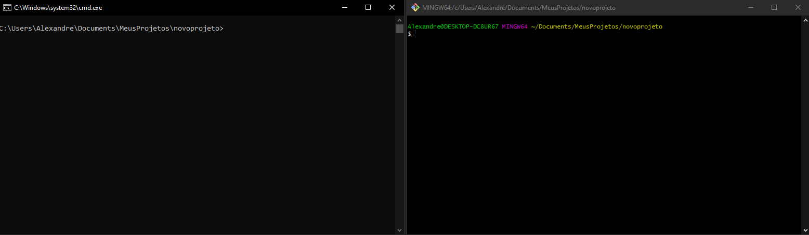

# Git
### Anotações e conhecimentos sobre Git adquiridos durante estudos.

## O que é Git ?

O Git é um **sistema de controle de versão** amplamente usado por programadores e empresas  para gerenciar o código fonte de um sistema, aplicação etc.

## Mas o que é um **sistema de controle de versão**?

O controle de versão, é a prática de rastrear e gerenciar alterações em um código de um sistema, ajudando as equipes de desenvolvimento durante o seu trabalho, para isso existem os sistemas de controle de versão distribuído, ou seja são vários repositórios independentes, sendo que cada um desses repositórios possui comunicação com o Branch principal do projeto. 

## Alguns conceitos importantes: 
### Branch, Commit e Readme

## Branch: 
Branch são basicamente versões de um sistema, quando iniciamos um repositorio com Git o branch inicial é o **Master**, ele também é o repositório principal do projeto, é recomendado a mudança do nome desse Branch para **Main**.

## Commit:
O Commit em um sistema de controle de versão, adciona as alterações recentes de um código fonte para o repositório Principal, ou seus Branches subordinados.

## Readme:
O readme é um arquivo de texto, presente em quase todos os repositórios, e é amplamente recomendada a sua presença, pois ele serve para passar instruções acerca de uso do sistema, informações sobre a sua criação, seu funcionamento, tecnologias usadas em seu desenvolvimento, entre outras informações importantes.

## Status de arquivos no Git 

Existem 4 status para arquivos no Git são eles: Untracked, Tracked, Modified e Staged. Sendo possível um arquivo navegar por estes estágios diversas vezes durante o processo de desenvolvimento.

### Untracked:
Um arquivo está com status Untracked quando ainda não está sendo monitorado pelo Git, um arquivo novo naquela pasta.

### Tracked:
Um arquivo está com status Tracked quando adcionado ao monitoramento do Git, ou seja o apartir de agora é possível controlar as versões daquele arquivo.

### Modified:
Um arquivo está com status Modified quando um arquivo que está sendo monitorado é modificado.

### Staged:
Um arquivo está com status Staged quando ele está pronto, ou seja já está sendo rastreado, foi modificado e finalizado, sendo assim pronto para ser enviado para o repositório usando commits.

# Iniciando um repositório Git

Para se iniciar um repositório Git, vá até uma pasta criada para o seu projeto, dentro dela, pressione o botão direito do seu mouse e vá até a opção **Git Bash Here**

Ou vá até a pasta usando o CMD, aqui no meu GitHub tenho anotações de como navegar por pastas usando o CMD [Acesse aqui.](https://github.com/xand3/CMD)

As telas do CMD e do Git Bash serão parecidas com essas:

Note que ambos apontam para a posta do projeto, escolha um dos terminais e vamos começar a digitar os comandos.

### Comandos 
O comando para iniciar o repositório é o `git init`. Ao clicar Enter você verá uma mensagem parecida com essa "Initialized empty Git repository in C:/Users/Alexandre/Documents/MeusProjetos/novoprojeto/.git/"
Outro comando importantíssimo e que será muito usado é o `git status`, Esse comando serve para sabermos o status dos nossos arquivos presentes no projeto, e recomendações do que fazer.

Digamos que você criou um novo arquivo na pasta do seu projeto, nesse momento esse arquivo está Untracked, ou sejá não está sendo monitorado pelo Git.
Se usarmos o comando `git status` uma mensagem como essa será mostrada:

Para adicionarmos esse arquivo ao Git usamos o comando `git add NomeDoArquivo.SuaExtensão` então se quiséssemos adicionar um arquivo chamado "index.html" o comando seria: `git add index.html`, ou o comando `git add -A` esse comando adiciona todos os arquivos novos que você criou sem precisar especificar o nome de cada um.

O comando `git add` não retorna nenhuma saida, mas se usarmos de novo o `git status`, veremos que temos um novo arquivo.

Apartir de agora o nosso arquivo está sendo monitorado e todas as suas modificações serão registradas e informadas pelo Git.
O próximo passo agora é commitar sobre a adição desse arquivo, fazendo com que o status desse arquivo se torne Staged.
O Comando para fazer commits é `git commit -m "ComentarioSobreOCommit"` veja o exemplo de commit adicionando o arquivo index.html.

A mensagem que é mostrada em seguida diz quantos arquivos foram modificados, quantas linhas de código foram escritas, e quantas foram deletadas.
Pronto com as modificações concluidas podemos commitar para um repositório remoto no GitHub, depois de criar sua conta, vá até repositórios e Crie um novo repositório, adcione informações como um nome, uma descrição do projeto, e defina se quer que ele seja público ou privado.
Depois de criar o repositório remoto, precisamos conectar ele ao nosso repositório local, para isso iremos copiar o link do repositório remoto e executar o seguinte comando no terminal para linkarmos o nosso repositório local ao remoto: `git remote add origin <link do repositório>`. 
Feito isso agora temos nosso repositório local totalmente conectado ao remoto no GitHub.

## Enviando e recebendo modificações
Para enviar mudanças feitas localmente para o nosso repositório remoto, usamos o comando: `git push origin main`, o comando executa um push, que se traduzido é empurre, ou seja empurrar as mudanças para o repositório remoto.

Para trazer para o repositório local mudanças feitas no repositório remoto, usamos o comando: `git pull origin main`, o comando faz um pull, que traduzindo é puxar, ou seja puxa todas as alterações feitas remotamente para localmente. 

**origin** se refere ao nosso repositório remoto, e **main** é o nome do nosso repositório local.

